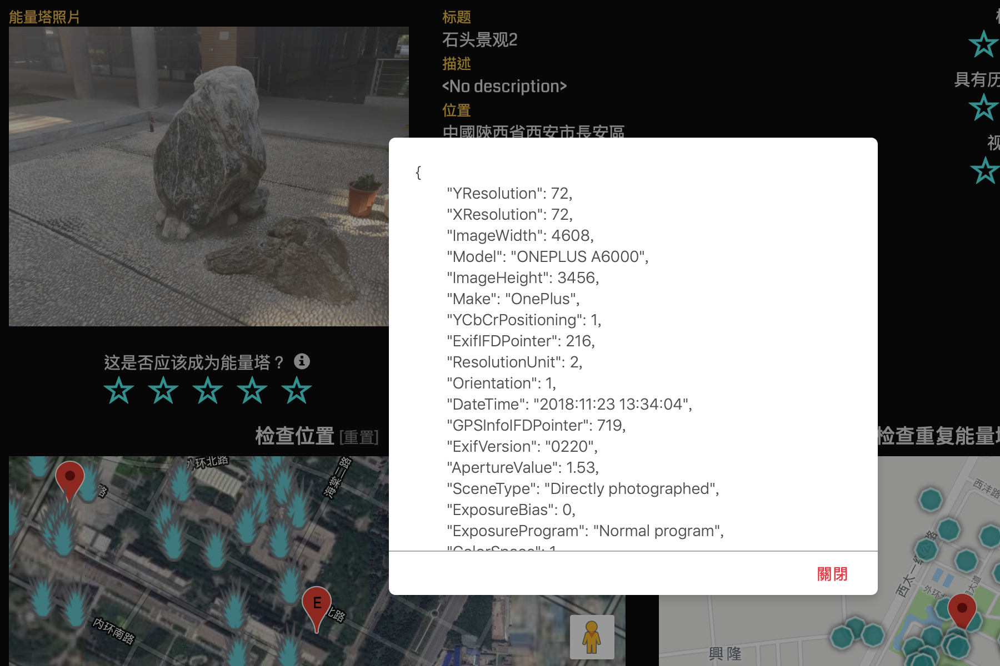
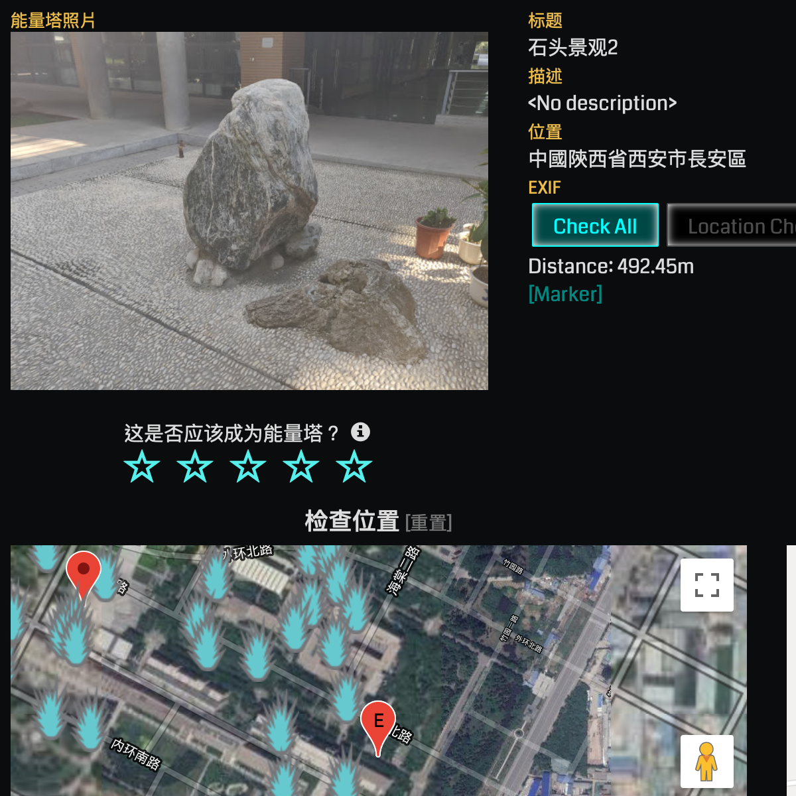
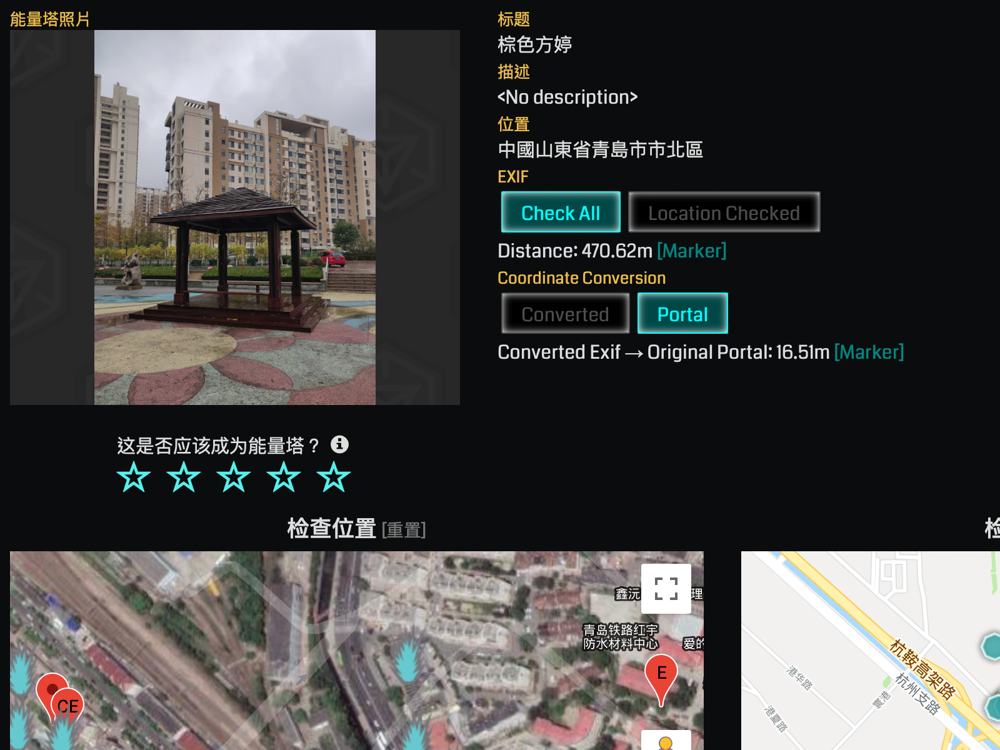

# Exif Viewer for Ingress OPR
View the exif metadata and check where the photo was taken.

## Function
- Decode the exif metadata
- View the exif metadata in JSON
- Check the location if the data exists, calculate the distance from the portal's location and show a marker on the map below
- Convert coordinates to WGS-84 from GCJ-02

## Usage
To use the script, click [here](https://lucka.moe/toolkit/ingress/OPR-Exif-Viewer.user.js) and install it with userscript manager like Tampermonkey, then there will be two new buttons on the OPR page, under the descriptions.

### Preference
From `0.1.4`, you can set the items of `preferences` to modify some functions.

| Item | Value | Description
| :--- | :--- | :---
| `autoRun`  | `true`<br/>`false` | Set to `true` if you want to get exif automatically when the page is loaded.

### Notice
- It may takes a while to fetch the full-size picture and decode the exif metadata, so be a little patient please.
- Maybe the location exif data is not common as you (or we) image, so don't be depressed, it's still helpful sometimes.
- About Coordinate Conversion - 关于坐标转换  
  If you suspect the location of either exif (such as some OnePlus devices) or portal is under GCJ-02 rather than WGJ-84, please try to use this function. Please notice the script can only convert the coordinate but **NOT detect GCG-02 coordinate**, you must judge by yourself.  
  如果您认为 EXIF 或能量塔的位置是 GCJ-02 坐标（即火星坐标，例如一加设备提交的照片 EXIF 位置很可能会是火星坐标），请尝试这一功能。但请务必注意：脚本只能进行坐标转换而**无法检测火星坐标**，因此您必须自行判断。

## Preview
  
*Full exif Metadata*

  
*Check Location*

  
*Coordinate Conversion*

## Dependencies & References
### Library
- [Exif.js](https://github.com/exif-js/exif-js)  
  A JavaScript library for reading EXIF meta data from image files.

### References
- [SmartIntel/opr_show_exif_info.user.js](https://github.com/DeepAQ/SmartIntel/blob/master/opr_show_exif_info.user.js)  
  Another exif viewer for OPR, learned how to use exif.js correctly.
- OPR_brainStroming  
  Useful plug-in for OPR, learned how to fetch the data of the portal.
- [eviltransform/transform.js](https://github.com/googollee/eviltransform/blob/master/javascript/transform.js)  
  Algorithm to convert GCJ-02 to WGS-84.

## Changelog
```markdown
### [0.1.9] - 2019-06-03
#### Changed
- Coordinate Convertion for Portal is always available now
- UI improved
```

```markdown
### [0.1.8] - 2019-03-28
#### Fixed
- subCtrl not defined without OPR_brainStroming 
```

```markdown
### [0.1.7] - 2019-03-27
#### Fixed
- autoRun doesn't work in some cases
```

```markdown
### [0.1.6] - 2019-02-05
#### Fixed
- Buttons don't show up sometimes
```

```markdown
### [0.1.5] - 2019-01-28
#### Changed
- Run the script when portal photo is loaded

#### Fixed
- jQuery reqiurement missing
```

```markdown
### [0.1.4] - 2019-01-15
#### Added
- Preference: autoRun
```

```markdown
### [0.1.3] - 2018-12-14
#### Added
- Coordinate Conversion
- Update URL & download URL
```

```markdown
### [0.1.2] - 2018-12-01
#### Changed
- Optimized, prevent redundant decoding
```

```markdown
### [0.1.1] - 2018-12-01
#### Added
- Marker of the exif location on the map

#### Removed
- Azimuth
```

```markdown
### [0.1.0] - 2018-12-01
- Initial version
```

## Licence
This userscript is released under the [MIT License](../../LICENSE).
